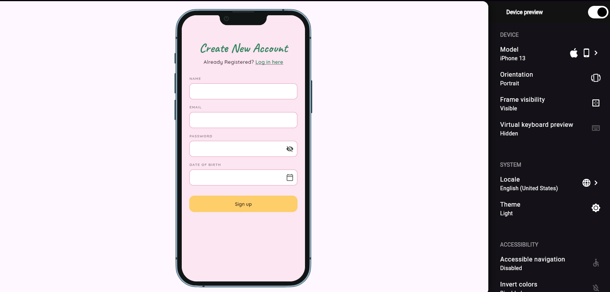

# SoLuna

> A private, shared space for couples to save, organize, and look back at their relationship memories together.

**Live demo:** https://MaeGoose.github.io/SoLuna/ <!-- GitHub Pages is set up already; replace if you host elsewhere -->
**Demo video:** `docs/demo.mp4`
**Course:** Applications Development and Emerging Technologies (6ADET), Holy Angel University
**Author:** Jacob Bernardo

---

## Screenshots

| Create Account |
| --- |
|  |


## What it does

- Create a private account shared by two people (a couple).
- Save relationship memories (photos, videos) organized into collections.
- Revisit "On This Day" memories as a rearrangeable photo collage.
- Manage the couple's profile, relationship status, and account settings.


## Built with

| | |
| --- | --- |
| Framework | Flutter (Dart) |
| State | `setState` (local widget state)  |
| Storage | Supabase  |
| Other packages | `google_fonts` (Caveat + Quicksand), `device_preview` |

## Running it yourself

```bash
flutter pub get
flutter run -d web-server --web-port 8080
```

Then open http://localhost:8080. Requires Flutter 3.44.9

### Environment variables

Supabase

## Privacy and secrets

- The app currently stores no personal data anywhere the Create Account form
  collects name/email/password/date of birth but only prints them to the
  debug console (`debugPrint`); nothing is persisted or sent anywhere.
- All screenshots and any sample data in this repo use placeholder
  information, no real personal information.

## Project documentation

| Document | |
| --- | --- |
| [Proposal](docs/01-proposal.md) | the problem, the users, the scope |
| [Mockup and wireframes](docs/02-mockup.md) | what it looks like, and the screen flow |
| [Design system](docs/03-design-system.md) | colors, type, spacing, components |
| [Weekly reports](docs/04-weekly-reports.md) | what happened each week |
| [Demo video](docs/05-demo-video.md) | the recording and what it shows |
| [Start here](START-HERE.md) | how this repo works (delete once you have read it) |
| [Security and privacy](docs/06-security-and-privacy.md) | the checklist, filled in |

## Status and what is next

**Works:** the Create Account screen — name/email/password/date-of-birth
fields, a real date picker, password visibility toggle, and a themed sign-up
button, all using the SoLuna design system (colors, type scale, spacing).

**Half done / not started:** the other five screens (Today/On This Day, On
This Day Expanded, Couple Dates, Couple Date Detail, Settings) exist only as
designs, not code. Sign up and log in don't actually create or check an
account — Supabase isn't connected. No automated tests beyond the default
smoke test.

**Next:** build the Today screen, then connect Supabase for real
authentication and shared memory storage.

## Credits

- Packages: see `pubspec.yaml`.
- Assets, icons, 3D models, sounds: Google Fonts.
- People who helped: 

## AI use


## Licence

MIT, see [LICENSE](LICENSE). Change it if you want different terms.
